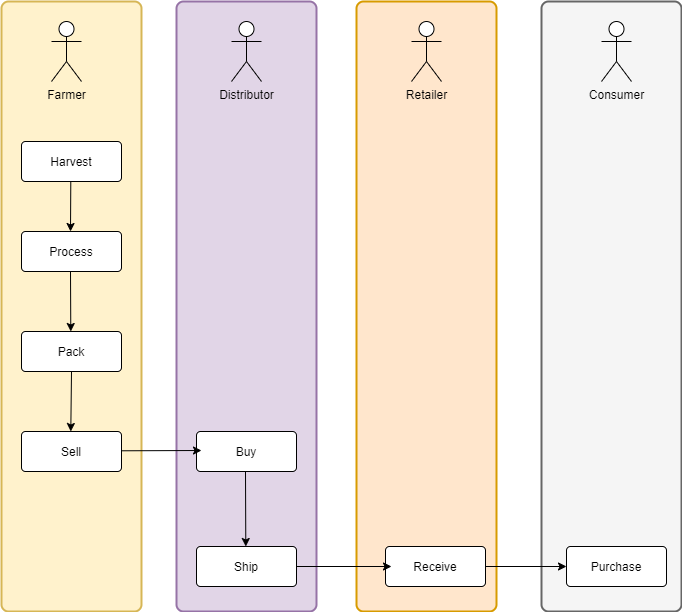
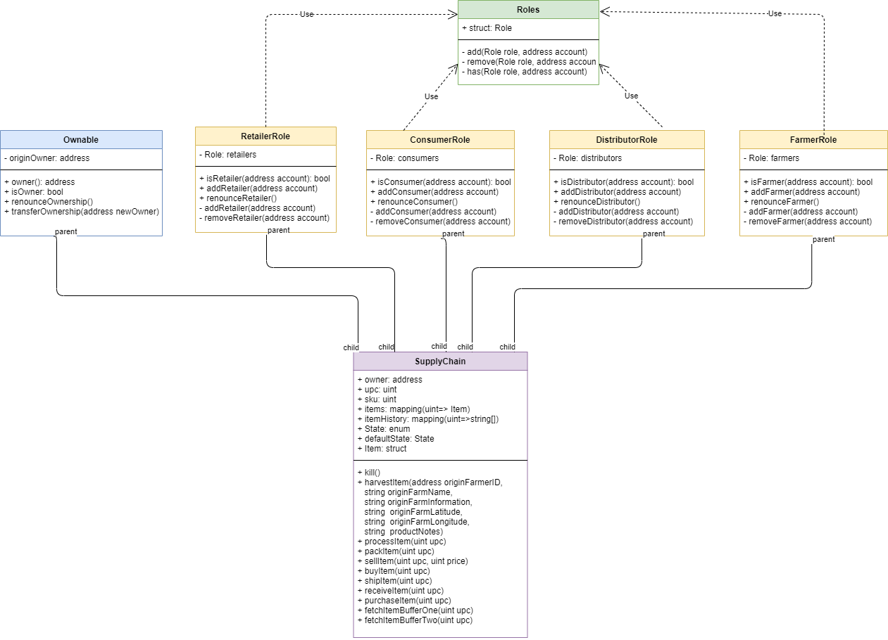
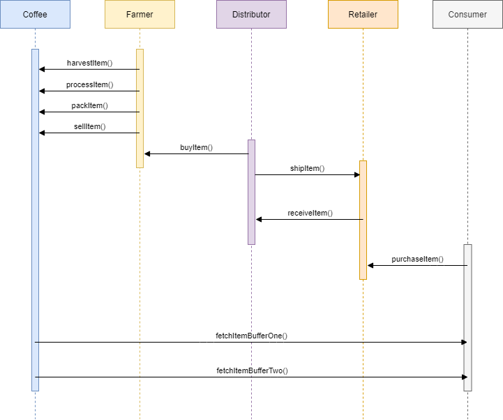
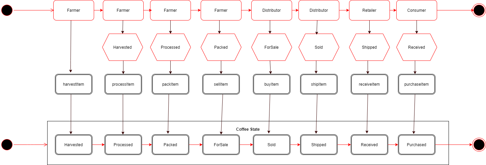

# Supply chain & data auditing

This repository containts an Ethereum DApp that demonstrates a Supply Chain flow between a Seller and Buyer. The user story is similar to any commonly used supply chain process. A Seller can add items to the inventory system stored in the blockchain. A Buyer can purchase such items from the inventory system. Additionally a Seller can mark an item as Shipped, and similarly a Buyer can mark an item as Received.

## Project UML diagram
### Activity


### Class Diagram


### Sequence Diagram


### State Diagram


## Project Write up
### Libraries used
### IPFS
no IPFS used in this project

### web3.js
Web3.js allows us to interact with the Ethereum blockchain

### truffle-hd-wallet-provider
Allows us to sign transactions for addresses

### Program Versions numbers
Node version 12.0.0, 
Truffle  v4.1.14, 
Solidity 0.4.24
web3 1.2.1

### Migration to Rinkeby Network


### Contract address on the Ropsten test network (Etherscan):
https://ropsten.etherscan.io/address/0x0Aa2021c5472e7982E126289EE062410952CeA5A

### Transactions:
**FarmerRole**: 0x30cdf8660463c4be0885715dfa1fa391e48902489f03834aac3244c3925704c5\
**DistributorRole**: 0x9e3d374a053cb535b37e03897011ec4d64d97e8a3dc814549245303aa5fd5753\
**RetailerRole**: 0x2dcd33e65830459c2214a8c27f55dccdb65cded480f1dffd04fbf78ea0890f8c\
**ConsumerRole**: 0x99b9de304eda4ef67ea87272bc9f19c684123ba756a99a1a0c512cbe01a21435\
**SupplyChain**: 0xae8baeaed2101972834fda1b581f2403352b7c5442958255aebe3656df67eb7e\
## Getting Started

These instructions will get you a copy of the project up and running on your local machine for development and testing purposes. See deployment for notes on how to deploy the project on a live system.

### Prerequisites

Please make sure you've already installed ganache-cli, Truffle and enabled MetaMask extension in your browser.

```
Give examples (to be clarified)
```

### Installing

> The starter code is written for **Solidity v0.4.24**. At the time of writing, the current Truffle v5 comes with Solidity v0.5 that requires function *mutability* and *visibility* to be specified (please refer to Solidity [documentation](https://docs.soliditylang.org/en/v0.5.0/050-breaking-changes.html) for more details). To use this starter code, please run `npm i -g truffle@4.1.14` to install Truffle v4 with Solidity v0.4.24. 

A step by step series of examples that tell you have to get a development env running

Clone this repository:

```
git clone https://github.com/udacity/nd1309/tree/master/course-5/project-6
```

Change directory to ```project-6``` folder and install all requisite npm packages (as listed in ```package.json```):

```
cd project-6
npm install
```

Launch Ganache:

```
ganache-cli -m "spirit supply whale amount human item harsh scare congress discover talent hamster"
```

Your terminal should look something like this:


In a separate terminal window, Compile smart contracts:

```
truffle compile
```

Your terminal should look something like this:


This will create the smart contract artifacts in folder ```build\contracts```.

Migrate smart contracts to the locally running blockchain, ganache-cli:

```
truffle migrate
```

Your terminal should look something like this:


Test smart contracts:

```
truffle test
```

All 10 tests should pass.


In a separate terminal window, launch the DApp:

```
npm run dev
```

## Built With

* [Ethereum](https://www.ethereum.org/) - Ethereum is a decentralized platform that runs smart contracts
* [IPFS](https://ipfs.io/) - IPFS is the Distributed Web | A peer-to-peer hypermedia protocol
to make the web faster, safer, and more open.
* [Truffle Framework](http://truffleframework.com/) - Truffle is the most popular development framework for Ethereum with a mission to make your life a whole lot easier.


## Authors

See also the list of [contributors](https://github.com/your/project/contributors.md) who participated in this project.

## Acknowledgments

* Solidity
* Ganache-cli
* Truffle
* IPFS
